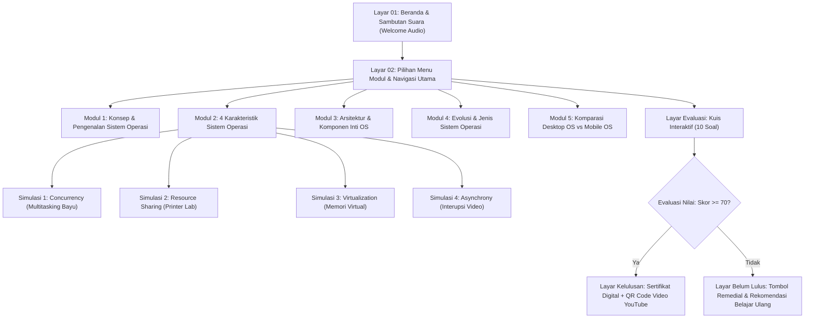

# DOKUMEN STORYBOARD MULTIMEDIA PEMBELAJARAN INTERAKTIF (MPI)
## MATA KULIAH: MULTIMEDIA PEMBELAJARAN
### TOPIK: SISTEM OPERASI (OPERATING SYSTEM)

---

## 1. IDENTITAS MEDIA PEMBELAJARAN

* **Judul Media**: Petualangan Menjelajahi Sistem Operasi (Interactive Operating System Learning Media)
* **Format Platform**: Web-Based Multimedia Pembelajaran Interaktif (Next.js 16 + Tailwind CSS + Interactive Vector Canvas/SVG)
* **Sasaran Pengguna**: Mahasiswa Semester 5 Teknik Informatika / Sistem Informasi / Siswa SMK RPL / TKJ
* **Tujuan Instruksional Umum (TIU)**:
  * Pengguna mampu memahami hakikat, arsitektur, dan cara kerja Sistem Operasi dalam mengelola sumber daya perangkat keras dan lunak.
* **Tujuan Instruksional Khusus (TIK)**:
  1. Menjelaskan definisi, sejarah, dan fungsi primer Sistem Operasi.
  2. Menganalisis 4 karakteristik utama OS (*Concurrency*, *Resource Sharing*, *Virtualization*, dan *Asynchrony*) melalui simulasi interaktif berbasis animasi real-time.
  3. Mengidentifikasi komponen arsitektur inti OS (Kernel, Penjadwalan CPU, Manajemen Memori, Sistem Berkas, dan I/O Drivers).
  4. Membedakan ragam evolusi antarmuka dan komparasi mendalam antara Desktop OS vs Mobile OS.
  5. Menguji penguasaan materi melalui kuis interaktif dengan penskoran otomatis dan umpan balik kelulusan.

---

## 2. DIAGRAM ALUR NAVIGASI (FLOWCHART MPI)

---

## 3. TABEL STORYBOARD PER LAYAR / SCENE

---

### SCENE 01: HALAMAN UTAMA / BERANDA & SAMBUTAN SUARA
* **ID Frame**: `FR-001`
* **Nama Halaman**: Beranda (Welcome Screen & Header Navigasi)

| Komponen | Spesifikasi Rancangan |
| :--- | :--- |
| **Deskripsi Visual** | - Background gradien modern (*Brand Blue & Slate*) dengan aksen kartu melayang. - Logo sistem operasi 3D di sudut kiri atas. - Banner sambutan dengan teks headline: *"Media Pembelajaran Interaktif: Menjelajahi Sistem Operasi"*. - Banner bot pendamping interaktif (*Byte-Bot*). - Tombol cepat *Mulai Belajar*, menu modul (1-5), dan Kuis Evaluasi. |
| **Konten Teks** | Headline: "Selamat Datang Para Penakluk Teknologi!" Sub-headline: "Pelajari cara kerja sistem operasi modern secara interaktif, visual, dan menyenangkan bersama simulator real-time." |
| **Audio / Narasi** | - **Voiceover Sambutan Otomatis (Web Speech Synthesis)**: *"Selamat datang para penakluk teknologi!"* - **SFX**: Suara klik renyah (*click.mp3*) saat tombol navigasi ditekan. |
| **Interaktivitas** | - Tombol **Mulai Belajar**: Menggulirkan layar otomatis ke Modul 1. - Navigasi Tab Bar: Berpindah langsung ke Modul 1, 2, 3, 4, 5, atau Kuis. - Tombol Play/Stop Sambutan Suara di header. |

---

### SCENE 02: MODUL 1 - KONSEP DASAR SISTEM OPERASI
* **ID Frame**: `FR-002`
* **Nama Halaman**: Modul 1 (Definisi, Analogi, & Fungsi Utama OS)

| Komponen | Spesifikasi Rancangan |
| :--- | :--- |
| **Deskripsi Visual** | - Layout kartu modular dengan ikon ilustrasi perangkat keras dan perangkat lunak. - Diagram interaktif: Lapisan Pengguna $\rightarrow$ Aplikasi $\rightarrow$ Sistem Operasi $\rightarrow$ Perangkat Keras (*Hardware*). - Ilustrasi analogi OS sebagai *"Manajer Restoran / Konduktor Orkestra"*. - Kartu sorotan: 3 Fungsi Utama OS (Pengendali Hardware, Pengelola Sumber Daya, Antarmuka Pengguna). |
| **Konten Teks** | Materi pengantar: Apa itu OS? Mengapa komputer tidak bisa hidup tanpa OS? Analogi konduktor orkestra yang mengatur ketukan musik agar tidak saling bertabrakan. |
| **Audio / Narasi** | SFX kartu interaktif saat kursor menyentuh elemen (*hover* & *click sound*). |
| **Interaktivitas** | - Kartu klik: Memunculkan penjelasan detail mengenai fungsi alokasi memori dan proteksi perangkat keras. - Tombol navigasi bawah: Menuju Modul 2 (*Karakteristik OS*). |

---

### SCENE 03: MODUL 2 - EMPAT PILAR KARAKTERISTIK SISTEM OPERASI
* **ID Frame**: `FR-003`
* **Nama Halaman**: Modul 2 (Dashboard Karakteristik OS)

| Komponen | Spesifikasi Rancangan |
| :--- | :--- |
| **Deskripsi Visual** | - Grid 4 kartu pilar interaktif:   1. **Concurrency** (Multitasking) - Tema Biru Sky   2. **Resource Sharing** (Berbagi Sumber Daya) - Tema Amber/Oranye   3. **Virtualization** (Memori Virtual) - Tema Ungu Indigo   4. **Asynchrony** (Penanganan Interupsi) - Tema Hijau Zamrud - Masing-masing kartu memiliki ikon 3D, ringkasan konsep, contoh dunia nyata, dan tombol *"Tonton Video Simulasi ... 🎬"*. |
| **Konten Teks** | Penjelasan 4 pilar fundamental yang membedakan Sistem Operasi dari program aplikasi biasa. |
| **Audio / Narasi** | SFX transisi saat membuka jendela simulator. |
| **Interaktivitas** | Menekan tombol simulasi pada salah satu kartu akan memicu modal dialog pop-up yang menyematkan video simulator SVG interaktif lengkap dengan narasi suara. |

---

### SCENE 03-A: VIDEO SIMULATOR 1 - CONCURRENCY (MULTITASKING BAYU)
* **ID Frame**: `FR-003-A`
* **Nama Halaman**: Modal Simulasi 1 (`public/simulasi-multitasking.html`)

| Komponen | Spesifikasi Rancangan |
| :--- | :--- |
| **Deskripsi Visual** | - Panggung animasi SVG 800x450 piksel berlatar ruang belajar Bayu. - Karakter Bayu dengan tangan mengetik dan kepala mengangguk mengikuti irama musik. - Layar laptop menampilkan 3 jendela: **Microsoft Word**, **Spotify (equalizer aktif)**, dan **Browser (progress bar unduhan)**. - Panel atas: Visualisasi **CPU 1-Core Time Slicing** yang berganti-ganti warna milidetik. - Baris kontrol bawah: Tombol Play/Pause (`▶ / ⏸`), Restart (`↺`), Mute (`🔊 / 🔇`), *Scrubber Timeline* (0–32 detik), dan Timer. |
| **Konten Teks** | Teks takarir (*captions*) berganti dinamis per detik: - Detik 0: *"Kenalkan Bayu, mahasiswa yang punya tiga urusan sekaligus..."* - Detik 4: *"Pertama, Bayu mengetik tugas di Word."* - Detik 8: *"Sambil itu, ia memasang headphone dan mendengarkan Spotify."* - Detik 12: *"Lalu ia mengunduh file referensi di browser..."* - Detik 18: *"Di balik layar: CPU hanya punya 1 core! OS membagi waktu (time slicing)..."* - Detik 26: *"Bagi Bayu semuanya terasa bersamaan. Itulah Concurrency!"* |
| **Audio / Narasi** | - File suara: [**`/suara/video1.mp4`**](file:///d:/KULIAH/SEMESTER%205/MULTIMEDIA%20PEMBELAJARAN/UTS/public/suara/video1.mp4) (Durasi ~32 detik). - Suara narator membaca takarir selaras dengan animasi mengetik, equalizer musik, dan unduhan file. |
| **Interaktivitas** | - Menggeser *scrubber slider* memajukan/memundurkan animasi dan suara secara presisi. - Tombol *Buka di Tab Baru ↗* untuk mode layar penuh. - Tombol *Bisukan Suara* untuk mematikan vokal narator. |

---

### SCENE 03-B: VIDEO SIMULATOR 2 - RESOURCE SHARING (PRINTER LAB)
* **ID Frame**: `FR-003-B`
* **Nama Halaman**: Modal Simulasi 2 (`public/simulasi-berbagi-printer.html`)

| Komponen | Spesifikasi Rancangan |
| :--- | :--- |
| **Deskripsi Visual** | - Panggung SVG 800x450 piksel bertema Lab Komputer. - Sisi Kiri: 10 Laptop Mahasiswa berwarna-warni terhubung kabel ke switch jaringan LAN. - Tengah: Titik-titik paket data bergerak dari laptop melintasi jaringan. - Kanan Atas: Kotak antrean **OS Print Spooler** dengan baris antrean bernomor rapi. - Kanan Bawah: Mesin **Printer Laser Fisik** yang mengeluarkan lembaran kertas tercetak satu demi satu secara bergantian. |
| **Konten Teks** | Takarir dinamis: - Detik 0: *"Di lab komputer ada 10 laptop, tetapi hanya 1 printer..."* - Detik 7.5: *"Kesepuluh mahasiswa menekan tombol Cetak via jaringan..."* - Detik 16: *"Sistem operasi menaruh semua tugas ke antrean cetak (spooler)..."* - Detik 24.5: *"Printer mengerjakan satu per satu sesuai urutan..."* - Detik 44.5: *"Semua tercetak dengan tertib. Itulah Resource Sharing!"* |
| **Audio / Narasi** | - File suara: [**`/suara/video2.mp4`**](file:///d:/KULIAH/SEMESTER%205/MULTIMEDIA%20PEMBELAJARAN/UTS/public/suara/video2.mp4) (Durasi ~51.5 detik). - Narator memandu jalannya pengiriman data, antrean spooler, hingga 10 berkas selesai dicetak. |
| **Interaktivitas** | - Pengguna dapat menelusuri status 10 mahasiswa secara bergantian. - Slider scrubber dan sinkronisasi audio dua arah (*two-way sync*). |

---

### SCENE 03-C: VIDEO SIMULATOR 3 - VIRTUALIZATION (MEMORI VIRTUAL)
* **ID Frame**: `FR-003-C`
* **Nama Halaman**: Modal Simulasi 3 (`public/simulasi-memori-virtual.html`)

| Komponen | Spesifikasi Rancangan |
| :--- | :--- |
| **Deskripsi Visual** | - Panggung SVG 800x450 piksel tema ungu memori. - Kiri: Ikon 4 aplikasi Bayu (Word, Browser, Spotify, Photoshop). - Tengah: Modul **OS Memory Manager** bertindak sebagai polisi lalu lintas memori. - Tengah Atas: 6 Slot **RAM Fisik Terbatas**. - Tengah Bawah: Piringan **Harddisk/SSD (Ruang Swap)** yang luas. - Kanan: Panel **Tampilan Virtual** yang dilihat aplikasi. - Balok memori bergerak (*Swap Out* panah oranye ke bawah, *Swap In* panah hijau ke atas). |
| **Konten Teks** | Takarir edukatif: - Detik 0: *"RAM Bayu terbatas, hanya 6 slot..."* - Detik 7: *"Bayu membuka Word. OS menaruh halaman di RAM."* - Detik 12: *"Lalu Browser & Spotify. RAM terisi penuh (6/6)!"* - Detik 20: *"Bayu membuka Photoshop. OS memindahkan halaman Word ke harddisk (swap out)..."* - Detik 27: *"Aplikasi tetap merasa punya memori lega. Kerumitan disembunyikan OS."* - Detik 37.5: *"Bayu kembali ke Word. OS menukar halaman kembali ke RAM (swap in)."* - Detik 51.5: *"Itulah Virtualization!"* |
| **Audio / Narasi** | - File suara: [**`/suara/video3.mp4`**](file:///d:/KULIAH/SEMESTER%205/MULTIMEDIA%20PEMBELAJARAN/UTS/public/suara/video3.mp4) (Durasi ~61.6 detik). - Sinkronisasi gerakan balok swap memori dengan penjelasan narator. |
| **Interaktivitas** | Kontrol Play/Pause, tombol Mute suara, dan scrubber timeline 0-61 detik. |

---

### SCENE 03-D: VIDEO SIMULATOR 4 - ASYNCHRONY (INTERUPSI VIDEO)
* **ID Frame**: `FR-003-D`
* **Nama Halaman**: Modal Simulasi 4 (`public/simulasi-interupsi-video.html`)

| Komponen | Spesifikasi Rancangan |
| :--- | :--- |
| **Deskripsi Visual** | - Panggung SVG 800x450 piksel tema hijau zamrud. - Kiri: Pemutar Video Layar Lebar dengan bola bergerak dan roda gerak (*video 60 FPS*). Di bawahnya terdapat tombol Volume, Like, CC, dan Screenshot. - Kanan: Modul **CPU** yang menampilkan status eksekusi normal vs interupsi. - Sinyal kilat kuning ⚡ memancar dari kursor mouse menuju CPU. - Bawah: Baris balok timeline kerja CPU (Balok Hijau = Memutar Video, Balok Merah = Menjalankan Interrupt Service Routine/ISR). |
| **Konten Teks** | Takarir interupsi: - Detik 0: *"Bayu menonton video. CPU memutar video frame demi frame."* - Detik 5: *"Bayu mengarahkan mouse dan mengeklik tombol..."* - Detik 8: *"Klik = interupsi! CPU menyimpan posisi video, lalu mengeksekusi ISR..."* - Detik 9.2: *"Selesai ditangani, video langsung lanjut tanpa macet sama sekali."* - Detik 26: *"Itulah Asynchrony: OS merespons interupsi mendadak tanpa membuat PC freeze."* |
| **Audio / Narasi** | - File suara: [**`/suara/video4.mp4`**](file:///d:/KULIAH/SEMESTER%205/MULTIMEDIA%20PEMBELAJARAN/UTS/public/suara/video4.mp4) (Durasi ~31.7 detik). - Efek suara dan takarir selaras dengan klik tombol dan sambaran sinyal kilat. |
| **Interaktivitas** | Timeline scrubber sinkron dengan audio, status counter: *"⚡ Interupsi ditangani: 4/4 | 🎞 Video freeze: 0 kali ✓"*. |

---

### SCENE 04: MODUL 3 - ARSITEKTUR & KOMPONEN INTI OS
* **ID Frame**: `FR-004`
* **Nama Halaman**: Modul 3 (Struktur Kernel, Scheduler, Memory, File System, & Drivers)

| Komponen | Spesifikasi Rancangan |
| :--- | :--- |
| **Deskripsi Visual** | - Diagram lapisan arsitektur: Hardware $\leftrightarrow$ Drivers $\leftrightarrow$ Kernel $\leftrightarrow$ System Calls $\leftrightarrow$ User Space. - Pilihan tab interaktif komponen:   1. **Kernel**: Monolithic vs Microkernel vs Hybrid.   2. **CPU Scheduler**: Algoritma Round Robin, FIFO, Shortest Job First.   3. **Memory Manager**: Paging, MMU, Segmentasi.   4. **File System**: Struktur folder direktori pohon, NTFS, ext4, FAT32.   5. **I/O Management**: Interrupt controller, Buffer cache, Device Drivers. |
| **Konten Teks** | Rincian mekanisme kerja internal kernel sebagai jantung sistem operasi yang menjalankan instruksi tingkat rendah dalam *Kernel Mode*. |
| **Audio / Narasi** | SFX tab switching. |
| **Interaktivitas** | Klik tab untuk melihat perbandingan mendalam dan diagram teknis masing-masing arsitektur. |

---

### SCENE 05: MODUL 4 - EVOLUSI & KLASIFIKASI SISTEM OPERASI
* **ID Frame**: `FR-005`
* **Nama Halaman**: Modul 4 (Garis Waktu Sejarah & Jenis OS)

| Komponen | Spesifikasi Rancangan |
| :--- | :--- |
| **Deskripsi Visual** | - *Interactive Timeline Card* evolusi OS:   - Generasi 1 (1940-an): Tabung hampa, tanpa OS.   - Generasi 2 (1950-an): Batch Processing System.   - Generasi 3 (1960-an): Multiprogramming & Time Sharing (UNIX lahir).   - Generasi 4 (1980-an): Era GUI & PC Pribadi (MS-DOS, Windows, Macintosh).   - Generasi 5 (2000-sekarang): Mobile OS, Cloud OS, RTOS pada IoT. - Komparasi visual: Terminal CLI (Hitam-Hijau) vs Tampilan Grafis GUI Modern. |
| **Konten Teks** | Penjelasan bagaimana OS berevolusi dari instruksi biner manual hingga antarmuka sentuh cerdas masa kini. |
| **Audio / Narasi** | SFX klik timeline dan efek ketikan suara keyboard retro. |
| **Interaktivitas** | Slider dan kartu geser horizontal untuk menjelajahi era sejarah OS. |

---

### SCENE 06: MODUL 5 - KOMPARASI SISTEM OPERASI DESKTOP VS MOBILE
* **ID Frame**: `FR-006`
* **Nama Halaman**: Modul 5 (Tabel Komparasi Karakteristik Desktop vs Mobile)

| Komponen | Spesifikasi Rancangan |
| :--- | :--- |
| **Deskripsi Visual** | - Header komparasi dengan badge pilar. - Kartu ringkasan karakteristik Desktop (Windows, macOS, Linux) dan Mobile (Android, iOS). - **Tabel Komparasi Menyeluruh**: Memuat 6 aspek vital (Perangkat Input, Manajemen Daya, Multitasking Jendela, Arsitektur Processor, Keamanan File System, dan Konektivitas). - Kartu kesimpulan pedoman memilih sistem operasi. |
| **Konten Teks** | Analisis komparatif: Mengapa arsitektur mobile sangat ketat dalam membatasi aplikasi latar belakang, sedangkan desktop memberikan kebebasan penuh pada daya listrik tanpa batas. |
| **Audio / Narasi** | SFX navigasi modul. |
| **Interaktivitas** | Tabel responsif yang dapat digeser di perangkat mobile, tombol lanjut menuju Kuis Evaluasi. |

---

### SCENE 07: EVALUASI - KUIS INTERAKTIF SISTEM OPERASI
* **ID Frame**: `FR-007`
* **Nama Halaman**: Halaman Kuis Evaluasi (10 Soal Pilihan Ganda)

| Komponen | Spesifikasi Rancangan |
| :--- | :--- |
| **Deskripsi Visual** | - Header Kuis dengan *Progress Bar* (Soal 1 s.d. 10) dan indikator nomor soal. - Kotak kartu soal berdesain elegan. - 4 Pilihan jawaban (A, B, C, D) dengan efek visual saat diklik. - Indikator visual instan: Pilihan benar (Hijau + centang), Pilihan salah (Merah + silang). - Kotak pembahasan edukatif yang muncul setelah jawaban dipilih. - Tombol *"Lanjut ke Soal Berikutnya"*. |
| **Konten Teks** | 10 Soal mencakup seluruh modul: definisi OS, multitasking, spooler printer, memori virtual, penanganan interupsi, struktur kernel, dan komparasi desktop-mobile. |
| **Audio / Narasi** | - **SFX Jawaban Benar**: Nada denting lonceng kemenangan (*bell chime*). - **SFX Jawaban Salah**: Nada buzzy lembut (*buzz tone*). |
| **Interaktivitas** | - Pengguna memilih jawaban $\rightarrow$ sistem mengunci pilihan $\rightarrow$ skor diperbarui secara otomatis $\rightarrow$ menampilkan pembahasan singkat $\rightarrow$ tombol lanjut aktif. |

---

### SCENE 08-A: HASIL EVALUASI - KELULUSAN & PENGAYAAN (SKOR $\ge$ 70)
* **ID Frame**: `FR-008-A`
* **Nama Halaman**: Halaman Hasil Kuis (Lulus)

| Komponen | Spesifikasi Rancangan |
| :--- | :--- |
| **Deskripsi Visual** | - Lencana Keberhasilan Emas (*Badge of Honor*): *"🎉 Selamat! Anda Lulus!"*. - Nilai Skor Akhir (misal: 90 / 100) dan predikat kelulusan. - **Kartu Pengayaan Materi**: Menampilkan **QR Code Interaktif** dan tombol link langsung menuju video YouTube pengayaan arsitektur sistem operasi modern. - Tombol Ulangi Kuis dan Tombol Kembali ke Beranda. |
| **Konten Teks** | *"Luar biasa! Pemahaman Anda mengenai Sistem Operasi telah melampaui batas standar kelulusan. Pindai QR Code di bawah untuk menyaksikan video dokumenter pengayaan materi tingkat lanjut."* |
| **Audio / Narasi** | - **Voiceover**: *"Selamat, Anda telah menuntaskan pembelajaran dengan hasil gemilang!"* - **SFX**: Musik fanfar selebrasi kemenangan (*fanfare victory sound*). |
| **Interaktivitas** | - Pindai QR Code menggunakan kamera ponsel untuk membuka tautan YouTube. - Tombol tautan langsung: Membuka URL YouTube di tab baru. - Tombol *Ulangi Kuis*: Mereset skor dan memulai kuis dari soal 1. |

---

### SCENE 08-B: HASIL EVALUASI - BELUM LULUS / REMEDIAL (SKOR < 70)
* **ID Frame**: `FR-008-B`
* **Nama Halaman**: Halaman Hasil Kuis (Belum Lulus)

| Komponen | Spesifikasi Rancangan |
| :--- | :--- |
| **Deskripsi Visual** | - Kartu evaluasi dengan warna hangat (*Amber/Rose*): *"Tetap Semangat! Sedikit Lagi Kamu Bisa!"*. - Tampilan Skor Akhir (misal: 50 / 100) dan batas minimal kelulusan (70). - Kotak rekomendasi modul mana saja yang perlu dibaca kembali (khususnya 4 video simulasi Modul 2). - Tombol besar: **"Coba Remedial Kuis Lagi 🔄"** dan **"Pelajari Ulang Modul 2 📖"**. |
| **Konten Teks** | Pesan motivasi belajar: *"Jangan berkecil hati! Skor Anda belum mencapai kriteria ketuntasan minimal (70). Tonton kembali video simulasi interaktif untuk memperkuat pemahaman konsep dasar sebelum mengulang kuis."* |
| **Audio / Narasi** | SFX motivasi lembut (*gentle chime*). |
| **Interaktivitas** | - Tombol *Coba Remedial*: Mengulang kuis dari awal. - Tombol *Pelajari Ulang Modul 2*: Mengarahkan siswa langsung ke pilar simulasi multitasking dan spooler printer. |

---

## 4. SPESIFIKASI ASET MULTIMEDIA

1. **Aset Grafis & Ilustrasi**:
   - `3d_laptop_code.png`: Ikon laptop koding (Modul 2 Pilar 1).
   - `3d_data_funnel.png`: Ikon corong data sharing (Modul 2 Pilar 2).
   - `server_rack_stack.png`: Ikon server virtualisasi (Modul 2 Pilar 3).
   - `3d_mouse.png`: Ikon interupsi input hardware (Modul 2 Pilar 4).
   - Format: Rasio 1:1, PNG Transparan 3D Glassmorphism.

2. **Aset Audio Narasi**:
   - `suara/video1.mp4`: Narasi Multitasking Bayu (32 detik).
   - `suara/video2.mp4`: Narasi Berbagi Printer di Lab (51.5 detik).
   - `suara/video3.mp4`: Narasi Memori Virtual Swap In/Out (61.6 detik).
   - `suara/video4.mp4`: Narasi Interupsi Video Tanpa Freeze (31.7 detik).
   - Web Speech Synthesis: Suara AI sambutan vokal pembuka bahasa Indonesia.

3. **Aset Eksternal / Video Pengayaan**:
   - Video Pengayaan YouTube: Tautan dan QR Code tersemat pada layar akhir kelulusan kuis.

---

*Dokumen ini dirancang sebagai panduan komprehensif implementasi dan pelaporan tugas Ujian Tengah Semester (UTS) mata kuliah Multimedia Pembelajaran.*
